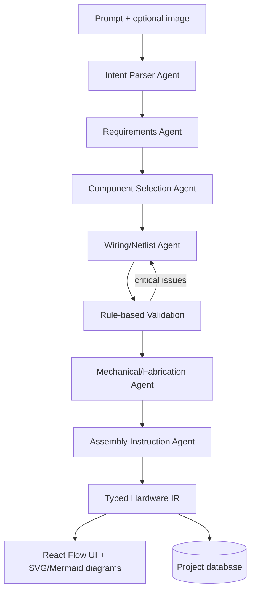

# Architecture

Blueprint OSS turns prompts into structured hardware projects using a sequential, validation-aware agent pipeline. The system is intentionally scoped to low-voltage maker electronics and emphasizes traceable, typed outputs.

## System pipeline
1. **Prompt + optional image** enters the system.
2. **Intent Parser Agent** produces a high-level `ProjectOverview`.
3. **Requirements Agent** extracts functional requirements and constraints.
4. **Component Selection Agent** chooses parts from the seed database.
5. **Wiring/Netlist Agent** generates connection nets and pin mappings.
6. **Validation rules** run on the netlist.
7. **Repair loop** re-invokes the wiring agent if critical issues are found.
8. **Mechanical/Fabrication Agent** drafts enclosure and fabrication notes.
9. **Assembly Instruction Agent** emits step-by-step build guidance.
10. **Hardware IR** is finalized and rendered in the UI.

## Orchestration and model runtime
- **Google ADK** orchestrates the sequential multi-agent workflow.
- **Gemini Flash** generates structured JSON outputs. The current implementation targets **Gemini 2.5 Flash** and is designed to be upgradeable to newer Flash models (for example, 3.5 Flash).
- If no API key is configured, the backend uses a deterministic simulation fallback with curated example projects.

## System diagram

## Core subsystems
- **Frontend (Next.js + React Flow):** Visualizes the structured project, nets, BOM, and instructions.
- **Backend (FastAPI):** Hosts the orchestration layer, validation, and storage APIs.
- **Database (Postgres/SQLite):** Stores component templates and generated projects.
- **Utilities:** Render Mermaid and SVG schematics from the IR.

## Output artifacts
- **Hardware IR JSON** (typed source of truth)
- **React Flow schematic** (interactive wiring view)
- **SVG schematic** (static vector view)
- **Mermaid diagram** (lightweight topology graph)
- **BOM + assembly steps**
