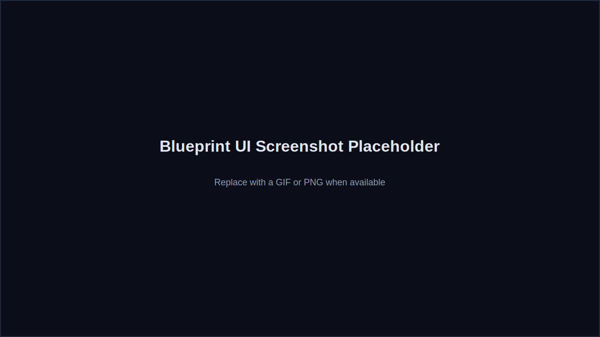

# Examples

Blueprint ships with a few example Hardware IR projects to make the MVP easy to explore without live agent calls.

## Example projects
- **Auto-Grow Plant Watering** (`examples/plant_watering.json`)
- **Smart Thermostat** (`examples/smart_thermostat.json`)
- **Biometric Deadbolt** (`examples/biometric_deadbolt.json`)

These same examples are mirrored in `frontend/public/examples/` for quick UI loading.

## What each example includes
- Typed Hardware IR (overview, requirements, components)
- Nets and pin mappings
- BOM data and estimated cost
- Assembly steps and mechanical notes
- Validation summary

## Screenshot placeholder

## Tips
- Use these examples to test the UI and explore the IR schema.
- Modify the JSON locally to see how the UI renders different configurations.
